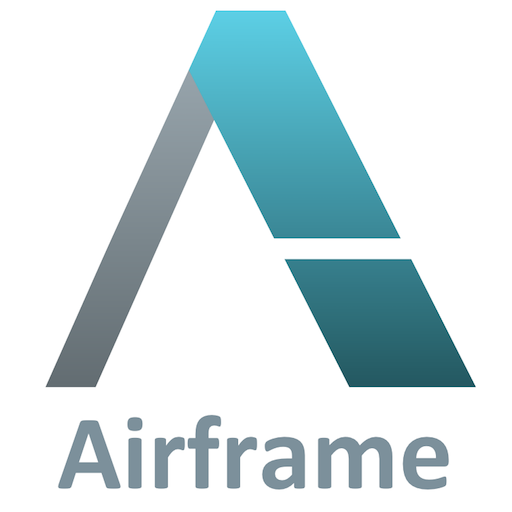

# Airframe [![Gitter Chat][gitter-badge]][gitter-link]    [![scala-index][sindex-badge]][sindex-link] [![maven central][central-badge]][central-link]  

[circleci-badge]: https://circleci.com/gh/wvlet/airframe.svg?style=svg
[circleci-link]: https://circleci.com/gh/wvlet/airframe
[gitter-badge]: https://badges.gitter.im/Join%20Chat.svg
[gitter-link]: https://gitter.im/wvlet/airframe?utm_source=badge&utm_medium=badge&utm_campaign=pr-badge&utm_content=badge
[coverall-badge]: https://coveralls.io/repos/github/wvlet/airframe/badge.svg?branch=master
[coverall-link]: https://coveralls.io/github/wvlet/airframe?branch=master
[sindex-badge]: https://index.scala-lang.org/wvlet/airframe/airframe/latest.svg?color=orange
[sindex-link]: https://index.scala-lang.org/wvlet/airframe
[central-badge]: https://img.shields.io/maven-central/v/org.wvlet.airframe/airframe_2.12.svg?label=maven%20central
[central-link]: https://search.maven.org/search?q=g:%22org.wvlet.airframe%22%20AND%20a:%22airframe_2.12%22

 

Airframe https://wvlet.org/airframe is a collection of lightweight building blocks for Scala.

- [Getting Started](https://wvlet.org/airframe/)

## Resources

- [Documentation](https://wvlet.org/airframe/docs)
- [Release Notes](https://wvlet.org/airframe/docs/release-notes.html)

## LICENSE

[Apache v2](https://github.com/wvlet/airframe/blob/master/LICENSE)
