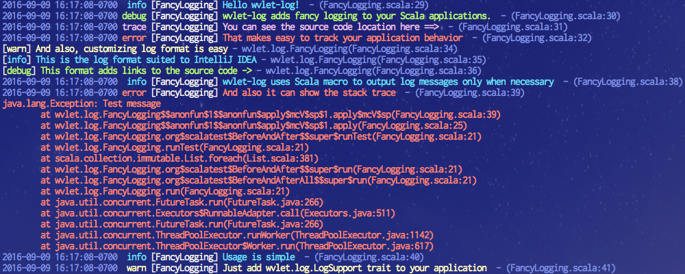

# wvlet-log  [![Gitter Chat][gitter-badge]][gitter-link] [](https://circleci.com/gh/wvlet/log) [![Coverage Status][coverall-badge-svg]][coverall-link]

[gitter-badge]: https://badges.gitter.im/Join%20Chat.svg
[gitter-link]: https://gitter.im/wvlet/wvlet?utm_source=badge&utm_medium=badge&utm_campaign=pr-badge&utm_content=badge
[coverall-badge-svg]: https://coveralls.io/repos/github/wvlet/log/badge.svg?branch=master
[coverall-link]: https://coveralls.io/github/wvlet/log?branch=master

wvlet-log is a libray for enhancing your Scala application logging with colors and source code locations.



**Features**:
- **Simple to use**
  - You can start logging by adding `wvlet.log.LogSupport` trait to your code. No need to write `Logger.getLogger(xxx)` anymore.
- **Fast and light-weight**
  - wvlet-log uses Scala macros for efficiency; log messsgages will be instanciated only when the log level is effective. 
  - wvlet-log is just an extension of JVM's built-in `java.util.logging`. So no need exists to add custom binding jars, such as logback-classic as in slf4j.
- **Informative**
  - ANSI colored logging support.
  - You can also show the **source code locations** (line number and pos) of log messages.
- **Fully customizable** 
  - log levels can be changed at ease with the periodic log-level scanner.
  - You can also change the log level through the standard JMX interface for `java.util.logging`.  
  - Easy to customize your own log format and log levels *inside* the code. No external XML configuration is required.
- **Production ready**
  - wvlet-log has built-in handlers for log file rotations, asynchronous logging.
  - Scala 2.11, 2.12 support
 
## Usage

[](https://maven-badges.herokuapp.com/maven-central/org.wvlet/wvlet-log_2.12/)

```scala
libraryDependencies += "org.wvlet" %% "wvlet-log" % "(version)"
```

### Using LogSupport trait

The most convenient way to use wvlet-log is adding `LogSupport` to your class:

```scala
import wvlet.log.LogSupport

object MyApp extends LogSupport  {
   info("info log")
   debug("debug log")
}
```

The logger name will be determined from your class name (e.g., `MyApp`).

Alternatively you can load `Logger` instance manually:

```scala
import wvlet.log.Logger

class YourApp {
   private val logger = Logger.of[YourApp]
}
```

### Configuring log levels

If `Logger.scheduleLogLevelScan` is called, wvlet-log periodically scans log-level properties file (default every 1 minute) to configure logger levels:

```scala
import wvlet.log.Logger

## Scan log files 
Logger.scheduleLogLevelScan
```

***log.properties*** example:
```
# You can use all, trace, debug, info, warn, error, info, all as log level
wvlet.airframe=debug
org.eclipse.jetty=info
org.apache.http=info
com.amazonaws=info
```
The format follows [Java Properties file format](https://docs.oracle.com/javase/7/docs/api/java/util/Properties.html#load(java.io.Reader)).


In default, loglevel file will be found in this order:  

 1. `log-test.properties` in the classpath. 
 1. If 1. is not found, use `log.properties` in the classpath.

To change the log file path, you can use `Logger.scheduleLogLevelScan(file paths, duration)`.

In debugging your application, create `src/test/resources/log-test.properties` file, and
call `Logger.scheduleLogLevelScan` before running test cases. This is useful for quickly checking the log messages. 

### Customizing log format

You can show the source code location where the log message is generated:

```scala
import wvlet.log._

object MyApp with LogSupport {
   Logger.setDefaultFormatter(LogFormatter.SourceCodeLogFormatter)
   info("log with source code")
}
```
This code will show:
```
[MyApp$] log with source code - (MyApp.scala:6)
```
### Pre-defined log formatters:
Here is the list of pre-defined log formatters. 
 - **SourceCodeLogFormatter** (with source code location) 
 - **AppLogFormatter** (without source code location)
 - **TSVLogFormatter** (logging in TSV format)
 - **IntelliJLogFormatter** (for debugging using IntelliJ console)
 - **SimpleLogFormatter** (just logger name and log message)
 - **BareFormatter** (shows only log message)

### Customising LogFormatter
You can also define your own LogFormatter:

```scala
import wvlet.log.LogFormatter._
object CustomLogFormatter extends LogFormatter {
  override def formatLog(r: LogRecord): String = {
    val log = s"[${highlightLog(r.level, r.leafLoggerName)}] ${highlightLog(r.level, r.getMessage)}"
    appendStackTrace(log, r)
  }
}

Logger.setDefaultFormatter(CustomLogFormatter)
```
See also the examples in [LogFormat.scala](src/main/scala/wvlet/log/LogFormat.scala):

### Using with slf4j

If you are using slf4j, just add `slf4j-jdk14` to your dependency. The log messages from slf4j will be sent to wvlet-log:
```
libraryDependencies += "org.slf4j" % "slf4j-jdk14" % "1.7.21"
```

### Writing and rotating logs with files 

To write and rotate your logs, use `LogRotationHandler`:
```
logger.resetHandler(new LogRotationHandler(
    fileName = "your-app.log",
    maxNumberOfFiles = 100, // rotate up to 100 log files
    maxSizeInBytes = 100 * 1024 * 1024 // 100MB
    AppLogFormatter // Any log formatter you like
))
```

If you simply need to output logs to a single file without any rotation, use `FileHandler`:
```scala
logger.resetHandler(new FileHandler(
    fileName = "your-app.log", // Log file name
    formatter = AppLogFormatter // Any log formatter you like
))
```

### Asynchronous logging

If you know your LogHandler is a heavy process (e.g., writing to network or slow disks), you can use 
`AsyncHandler` to do the logging in a background thread:

```scala
val asyncHandler = new AsyncHandler(a heavy parent log handler)
try {
  logger.resetHandler(asyncHandler)
}   
finally {
  asyncHandler.close // To flush unwritten log messages
}
```
Note that however AsyncHandler has usually higher overhead than the default handler since the asynchronous process involves locking and signal calls. 
We recommend to use AsyncHandler only if you know the overhead of the log writing is considerably high. 
LogRotationHandler is already optimized for writing logs to files, so you usually don't need to use AsyncHandler with LogRotationHandler. 

## Internals

### Scala macro based logging code generation

wvlet-log is efficient since it generate the log message objects only when necessary. 
For example, this logging code:
```scala
debug(s"heavy debug log generation ${obj.toString}")
```
will be translated into the following efficient one with Scala macros:
```scala
if(logger.isDebugEnabled) {
   debug(s"heavy debug log generation ${obj.toString}")
}
```
Log message String generation will not happen unless the debug log is effective. 
Scala macro is also used for finding source code location (LogSource).


## Why it uses java.util.logging instead of slf4j?

*slf4j* is just an API for logging string messages, so there is no way to configure the log levels and log format *within your program*. To use slf4j, you always need to include an slf4j 
binding library, such as *logback-classic*. slf4j's logging configuration is binder-specific (e.g., slf4j-simple, logback-classic, etc.), 
and your application always need to include a dependency to one of the slf4j implementations. There is nothing wrong in it if these slf4j bindings are used properly, but 
third-party libraries often include slf4j bindings as dependencies, and cause unexpected logging behaviour.  

`java.util.logging` is a standard API of Java and no binding library is required, but configuring `java.util.logging` was still difficult and error prone (See an example in [Stack Overflow](http://stackoverflow.com/questions/960099/how-to-set-up-java-logging-using-a-properties-file-java-util-logging)) 
 *wvlet-log* makes things easier for Scala developers.


## Related Projects
 
- [scala-logging](https://github.com/typesafehub/scala-logging): 
An wrapper of *slf4j* for Scala. This also uses Scala macros to make logging efficient. No built-in source code location format, and you still need some slf4j bindings and its configuration. 

- [twitter/util-logging](https://github.com/twitter/util#logging): This is also an wrapper of `java.util.logging` for Scala, but it doesn't use Scala macros, so you need to use an old sprintf style log generation, or `ifDebug(log)` 
method to avoid expensive log message generation. 

