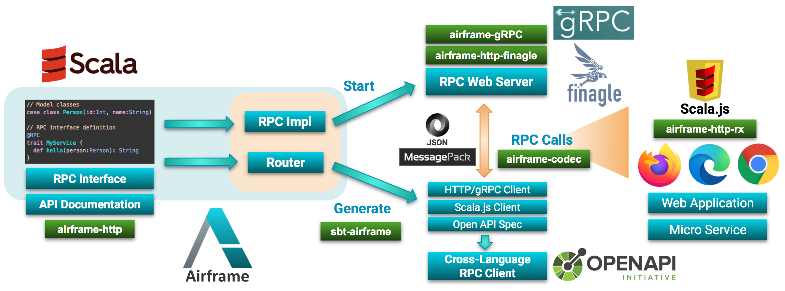

Airframe RPC is a framework for building RPC services by using Scala as a unified interface between
servers and clients.



**Airframe RPC Features**:

- Use plain Scala functions as RPC endpoints.
- Support [Finagle](https://twitter.github.io/finagle/) (HTTP/1) or [gRPC](https://grpc.io/) (HTTP/2) backends.
- [sbt-airframe](#sbt-airframe-plugin) plugin to generate RPC clients. No need to make HTTP requests
  by yourself.
- [Scala.js](https://www.scala-js.org/) support for building interactive web browser applications.
- [Open API](https://www.openapis.org/) schema generation.

## Why Airframe RPC?

Airframe RPC enables calling Scala methods at remote servers. You don’t need to worry about how to
encode your data into JSON, nor how to define HTTP REST endpoints. Airframe RPC abstracts away these
details; the framework generates the code for serializing your data objects into JSON
or [MessagePack](https://msgpack.org/) and calls appropriate HTTP endpoints on your behalf.

For defining RPC services, we need to define functions and data structures for representing HTTP
requests and responses. Airframe RPC leverages the nature of Scala as a functional and
object-oriented programming language; You can use plain Scala functions as RPC endpoints
and [case classes](https://docs.scala-lang.org/tour/case-classes.html) for modeling complex data.
Here is an example of Airframe RPC interface:

```scala
// An example RPC definition using Airframe RPC
@RPC
trait Greeter {
  // RPC endpoint definition
  def hello(name: String): GreeterResponse = GreeterResponse(s"Hello ${name}!")
}

// A model class defined with case class.
// This will be encoded into JSON {"message":"...."} or its MessagePack representation
case class GreeterResponse(message: String)

```

While [gRPC](https://grpc.io/) has been a popular approach for building RPC services, its ecosystem
often uses [ProtocolBuffers](https://developers.google.com/protocol-buffers/docs/overview) for
defining data structures and RPC methods. To start using gRPC in Scala, we need to bridge the gap
between ProtocolBuffers and Scala (e.g., [ScalaPB](https://scalapb.github.io/)). gRPC itself,
however, is a data-format agnostic framework. So, in order to naturally use Scala for gRPC, we
extended gRPC to support MessagePack (a compact binary alternative of JSON) and
used [airframe-codec](airframe-codec.md) for message serialization so that we can create RPC
services without introducing ProtocolBuffers.

Airframe RPC also supports building HTTP/1 services backed
by [Finagle](https://twitter.github.io/finagle/). Supporting both HTTP/1 and HTTP/2 is important
because gRPC heavily uses HTTP/2 features, but HTTP/1-based web clients including web browsers still
don't fully support HTTP/2.

In 2020, Scala.js, which can compile Scala code into JavaScript,
finally [became 1.0.0 after 7 years of development](https://www.scala-js.org/news/2020/02/25/announcing-scalajs-1.0.0/)
. This also has paved a way for using Scala both for servers (Scala JVM) and clients (Scala.js with
Ajax call with HTTP/1). We explored the approach for using Scala's functional interfaces as RPC
endpoint definitions, and successfully created Airframe RPC, which works both for Scala JVM and
Scala.js, on top of [technology stack of 20+ Airframe modules](index.md).

Although Airframe RPC is a relatively new project started at March 2020
inside [Treasure Data](https://www.treasuredata.com/), this project has proved various
advantages. For example:

- __Free from REST__. We can just use Scala's functional interface for defining
  servers. [Google's REST API Design Guide](https://cloud.google.com/apis/design) has been useful
  resources for defining clear REST API endpoints, but we've found using programming language's
  native interface is much easier.
- __No more web-framework wars__. In Scala, there are many web frameworks, such
  as [Finatra](https://github.com/twitter/finatra), [Finch](https://github.com/finagle/finch)
  , [Akka HTTP](https://doc.akka.io/docs/akka-http/current/index.html), and our
  own [airframe-http](airframe-http.md), etc. Each of them has its own pros and cons, and choosing
  one of them has been a hard choice for us. Now, we can just start from Airframe RPC using plain
  Scala interfaces. If necessary, we can use airframe-http for adding custom HTTP endpoints.
- __Seamless integration with Scala.js__. Writing web browser applications in JavaScript that
  interact with servers is not easy. You may need to learn about the existing frameworks
  like [React.js](https://https://reactjs.org/), [Vue.js](https://vuejs.org), and a lot of
  techniques for using them. By using Scala both for server and client code, an engineer just joined
  the company could write an RPC application using Scala and Scala.js in a few days.

## Airframe RPC: Overview

For using Airframe RPC, first, define your RPC service interface using regular Scala functions by
adding `@RPC` annotation. All public methods in this class will be your RPC endpoints. For the
method arguments and return types, you can use arbitrary types (
See [Object Serialization](#object-serialization) for the list of available types). To pass complex
messages, you can use case classes.

```scala
package hello.api.v1

import wvlet.airframe.http._

// A model class. This will be serialized into JSON or MessagePack
case
class Person(id: Int, name: String)

// RPC interface definition
@RPC
trait MyService {
  def hello(person: Person): String
}

```

Next, implement this service interface in Scala:

```scala
package hello.api.v1

import wvlet.airframe.http._

class MyServiceImpl extends MyService {
  override def hello(person: Person): String = s"Hello ${person.name} (id=${person.id})!"
}
```

To start an RPC web server, Airfarme RPC provides Finagle-based web server implementation. The
following code starts an RPC web server at `http://localhost:8080/`:

```scala
// Create a Router
val router = Router.add[MyServiceImpl]

// Starting a new RPC server.
Finagle
  .server
  .withRouter(router)
  .withPort(8080)
  .start { server =>
     server.waitForTermination
  }
```

To access the RPC server, we need to generate an RPC client from the RPC interface definition. We
can use an RPC client `hello.api.v1.ServiceRPC` interface generated
by [sbt-airframe](#sbt-airframe-plugin), which reads an RPC interface code and generates HTTP client
code for calling RPC methods.

Now, you are ready to call remote Scala methods:

```scala
import hello.api.v1._

// Create an RPC client

val client = ServiceRPC.newRPCSyncClient(Http.client.newSyncClient("localhost:8080"))

// Your first RPC call!
client.myService.hello(Person(id = 1, name = "leo")) // "Hello leo (id=1)!"
```

That’s it! Now you can call remote Scala methods as if they were regular Scala functions. Airframe
RPC also supports asynchronous clients using Future.

## Usage

The basic flow of using Airframe RPC is as follows:

1. Define RPC interfaces with `@RPC` annotation
1. Implement the RPC interfaces in Scala
1. Create `wvlet.airframe.http.Router` by adding the RPC interface implementation classes.
1. Generate RPC client code with sbt-airframe plugin

### Basic Project Structure

Here is an example build configurations for using Airframe RPC with Scala and Scala.js.

[](https://search.maven.org/search?q=g:%22org.wvlet.airframe%22%20AND%20a:%22airframe_2.12%22
)

__project/plugins.sbt__

```scala
// For RPC client generation
addSbtPlugin("org.wvlet.airframe" % "sbt-airframe" % "(version)")

// [optional] For Scala.js
addSbtPlugin("org.scala-js" % "sbt-scalajs" % "1.1.0")
addSbtPlugin("org.portable-scala" % "sbt-scalajs-crossproject" % "1.0.0")
```

__build.sbt__

```scala
val AIRFRAME_VERSION = "(version)"

// Common build settings
val buildSettings = Seq(
  organization := "(your organization)",
  scalaVersion := "2.12.10"
  // Add your own settings here
)

// RPC API definition. This project should contain only RPC interfaces
lazy val api =
  crossProject(JSPlatform, JVMPlatform)
    .crossType(CrossType.Pure)
    .in(file("myapp-api"))
    .settings(
       buildSettings,
       libraryDependencies += "org.wvlet.airframe" %%% "airframe-http" % AIRFRAME_VERSION
    )

lazy val apiJVM = api.jvm
lazy val apiJS = api.js

// RPC server project
lazy val server =
  project
    .in(file("myapp-server"))
    .settings(
      buildSettings,
      libraryDependencies ++= Seq(
        "org.wvlet.airframe" %% "airframe-http-finagle" % AIRFRAME_VERSION,
        // [For gRPC] Use airframe-http-grpc instead of Finagle
        "org.wvlet.airframe" %% "airframe-http-grpc" % AIRFRAME_VERSION
      )
    )
    .dependsOn(apiJVM)

// RPC client project
lazy val client =
  project
    .in(file("myapp-client"))
    .enablePlugins(AirframeHttpPlugin)
    .settings(
      buildSettings,
      // Generate an RPC client for myapp.app.v1 package
      airframeHttpClients := Seq("myapp.app.v1:rpc"),
      // Enable debug logging of sbt-airframe
      airframeHttpGeneratorOption := "-l debug",
      libraryDependencies ++= Seq(
        // Add this for using gRPC
        "org.wvlet.airframe" %% "airframe-http-grpc" % AIRFRAME_VERSION
      )
   )
   .dependsOn(apiJVM)

// [optional] Scala.js UI using RPC
lazy val ui =
  project
    .in(file("myapp-ui"))
    .enablePlugins(ScalaJSPlugin, AirframeHttpPlugin)
    .settings(
      buildSettings,
      // Scala.js only supports async clients
      airframeHttpClients := Seq("myapp.app.v1:rpc"),
      // Enable debug logging of sbt-airframe
      airframeHttpGeneratorOption := "-l debug"
    )
    .dependsOn(apiJS)
```

### sbt-airframe plugin

sbt-airframe plugins supports generating HTTP clients for making RPC calls. sbt-airframe supports
generating async, sync, or Scala.js HTTP clients.

[](https://search.maven.org/search?q=g:%22org.wvlet.airframe%22%20AND%20a:%22airframe_2.12%22
)

Add the following plugin settings:

__project/plugins.sbt__

```scala
addSbtPlugin("org.wvlet.airframe" % "sbt-airframe" % "(version)")
```

To generate HTTP clients, add `airframeHttpClients` setting to your `build.sbt`. You need to specify
which API package to use for generating RPC clients. The format
is `<RPC package name>:<client type>(:<target package name>(.<target class name)?))?`. For example:

__build.sbt__

```scala
enablePlugins(AirframeHttpPlugin)

airframeHttpClients := Seq("hello.api.v1:rpc")
```

With this setting, sbt-airframe generates `hello.api.v1.ServiceRPC` class. You can create RPC clients from this class with `.newSyncClient(...)` and `.newAsyncClient(...)`. Sync clients are blocking RPC clients, which wait until the method recevies RPC responses from the RPC server. Async clients returns `Future[_]` response type so that you can do other jobs while waiting the response. The generated client code can be found in `target/scala-(scala version)/src_managed/(api package)/` folder.

To rename the generated client name, append the desired class name followed by comma:
```scala
airframeHttpClients := Seq("hello.api.v1:rpc:HelloRPC")
```
This example generates `hello.api.v1.HelloRPC` class.

#### Supported RPC Client Types

Supported client types are:

- __rpc__ : Create a default RPC client class for Scala JVM (sync and async) and Scala.js (async-only)
- __grpc__: Create gRPC client (ServiceGrpc: SyncClient, AsyncClient)


- __sync__: (legacy client. Use rpc instead) Create a sync HTTP client (ServiceSyncClient) for Scala (JVM)
- __async__: (legacy client. Use rpc instead) Create an async HTTP client (ServiceClient) for Scala (JVM) using Future
  abstraction (`F`). The `F` can be `scala.concurrent.Future` or twitter-util's Future.
- __scalajs__:  (legacy client. Use rpc instead) Create an RPC client (ServiceClientJS)

Internally, sbt-airframe generates these clients using [HTTP code generators](https://github.com/wvlet/airframe/blob/master/airframe-http-codegen/src/main/scala/wvlet/airframe/http/codegen/client/ScalaHttpClientGenerator.scala). This code reads a Router definition of RPC interfaces, and generate client code for calling RPC endpoints. Currently, we only supports generating HTTP clients for Scala. In near future, we would
like to add Open API spec generator so that many programming languages can be used with Airframe
RPC.


#### sbt-airframe commands

When you change your API interface, run `airframeHttpReload` command to update your RPC client: 

```scala
# Regenerate the generated client code.Use this if RPC interface has changed
> airframeHttpReload

# Generating RPC clients manually
> airframeHttpGenerateClients

# Clean the generated code
> airframeHttpClean
```

### Open API

sbt-airframe plugin also supports generating [Open API](http://spec.openapis.org/oas/v3.0.3)
specification from Airframe RPC interfaces. To generate OpenAPI spec from RPC definition,
add `airframeHttpOpenAPIPackages` configuration to your build.sbt:

```scala
// [Required] RPC packages to use for generating Open API specification
airframeHttpOpenAPIPackages := Seq("hello.api")
// [Optional] Specify target directory to generate openapi.yaml. The default is target directory
airframeHttpOpenAPITargetDir := target.value
// [Optional] Additional configurations (e.g., title, version, etc.)
airframeHttpOpenAPIConfig := OpenAPIConfig(
  title = "My API", // default is project name
  version = "1.0.0", // default is project version,
  format = "yaml", // yaml (default) or json
  filePrefix = "openapi" // Output file name: (filePrefix).(format)
)
```

With this configuration, Open API spec will be generated when running `package` task:

```scala
> package
```

Or you can manually trigger OpenAPI file generation:

```scala
> airframeHttpOpenAPIGenerate
```


It will generate `target/openapi.yaml` file.

### RPC Logging

Airframe RPC stores HTTP access logs to `log/http-access.json` by default. This json logs contains
HTTP request related parameters and RPC-specific fields described below:

- __rpc_interface__: RPC interface class name
- __rpc_class__: The atual RPC implementation class name
- __rpc_method__: The RPC method name
- __rpc_args__: The RPC call argument parameters described in JSON

These parameters can be used for debugging your RPC requests.

See also [airframe-http: Access Logs](airframe-http.md#access-logs) for more details.

### RPC Filters

(This feature is not available for gRPC backend)

Airframe RPC can chain arbitrary HTTP request filters before processing HTTP requests. Most typical
use cases would be adding an authentication filter for RPC calls:

```scala
import wvlet.airframe.http._
import wvlet.airframe.http.HttpMessage.{Request,Response}

object AuthFilter extends Http.Filter {
  def apply(request: Request, context: Context): Future[Response] = {
    val auth = request.authorization
    if (isValidAuth(auth)) {
      // Call the next filter chain
      context(request)
    }
    else {
      // Reject the request
      throw RPCStatus.UNAUTHENTICATED_U13.newException("Invalid user")
    }
  }
}
```

```scala
// Router for RPC
val rpcRouter = Router.add[MyApp]

// Add a filter before processing RPC requests
val router = Router
        .add(AuthFilter)
        .andThen(rpcRouterr)
```

### DI Integration

Airframe RPC natively supports [Airframe DI](airframe-di.md) for dependency injection so that you can
inject necessary components for running your web service using `bind[X]` syntax or constructor
injection. DI is useful when building web applications requiring many components and if you need to
decouple component implementations from the service implementations. Airframe DI also supports
switching component implementations between production and tests for the convenience of module
tests.

Here is an example of using Airframe DI for starting an RPC server:

```scala
import wvlet.airframe._

trait MyAPIImpl extends MyAPI {
  // Inject your component
  private
  val myService = bind[MyService]

  override def hello(
  ...) =...
}

val router = Router.add[MyAPIImpl]

// Define the component implementation to use
val design = newDesign
  .bind[MyService].toInstance(new MyServiceImpl(...))
  .add(Finagle.server.withRouter(router).design)

// Launch a Finagle Server
design.build[FinagleServer] { server =>
  server.waitForTermination
}
```

### Object Serialization

Airframe `@RPC` interface supports almost all commonly used data types in Scala (and Scala.js). Note
that some Java-specific classes (e.g., ZonedDateTime) is not supported in Scala.js.

Here is the list of available data types:

- case classes whose parameter types (including generic types) are described in this list.
- Primitive types (Int, Long, String, Double, Float, Boolean, etc)
- java.util.UUID
- java.time.Instant (recommended because it can be used for Scala.js too)
  - (JVM only) ZonedDataTime, java.util.Date. These types cannot be used in Scala.js.
- Collection types: Seq, IndexedSeq, List, Set, Array, Map, Tuple (up to 21 parameters), Option,
  Either.
- Exception, Throwable
  - Exception types will be serialized as GenericException for safety.
- [airframe-metrics](airframe-metrics.md) types: ElapsedTime, DataSize, Count, etc.
- Raw Json, JSONValue, MsgPack values.
- Enum-like case object class, which has `object X { def unapply(s:String): Option[X] }` definition.
  String representation of enum-like classes will be used. Scala's native Enumeration classes are
  not supported.

Airframe RPC internally uses [schema-on-read functionality of airframe-codec](airframe-codec.md) for
serializing messages between server and clients. Even if the data type is slightly different from
the target type, for example, if the input data is "100", but the target type is Int, the input
String "100" will be translated into an Int value `100` automatically.

### RPCContext

Since Airframe 22.8.0, airframe-rpc introduced `RPCContext` for reading and writing the thread-local storage, and referencing the original HTTP request: 

```scala
import wvlet.airframe.http._

@RPC
trait MyAPI {
  def hello: String = {
    // Read the thread-local storage
    val userName = RPCContext.current.getThreadLocal[String]("context_user")
    s"Hello ${userName}"
  } 
  
  def authTest: String = {
    // Read the original http request
    RPCContext.current.httpRequest.authorization match {
      case Some(auth) if isValidAuth(auth) => 
        "Ok"  
      case _ =>
         throw RPCStatus.PERMISSION_DENIED_U14.newException(s"invalid user")
    }
  }
}
```

RPCContext is available both for Finagle and gRPC backend.

### Receiving Raw HTTP Responses

> ⚠️ Since Airframe 22.8.0, we no longer recommend adding Request as RPC parameters.  Use RPCContext.current.httpRequest instead

If you need to manage HTTP request specific parameters (e.g., HTTP headers), you can add request
object to the RPC arguments.

```scala
import wvlet.airframe.http._
import wvlet.airframe.http.HttpMessage.{Request, Respone}

@RPC
trait MyAPI {
  def rpc1(p1: String, p2: Int, request: Request): Response
}
```

### Reporting Errors with RPCStatus

Airframe RPC provides predefined [RPCStatus](https://github.com/wvlet/airframe/blob/master/airframe-http/src/main/scala/wvlet/airframe/http/RPCStatus.scala) code for reporting application errors at ease. In your RPC implementation, use one of the RPCStatus codes and create an exception with `.newException(...)` method to report an error:


```scala
import wvlet.airframe.http._

@RPC
trait MyApp {
  def helloRPC(msg: String): String = {
    // This will report the error code, error message, and the stack trace inside the response body.
    // See the table below to see the http status code that will be returned to the client.
    throw RPCStatus.INVALID_REQUEST_U1.newException("Unexpected message")
  }
}
```

If necessary, you can pass an application specific error code `appErrorCode` and more detailed metadata in the form of `Map[String, Any]` using the `.newException` arguments. Note: This metadata needs to be serializable. See [Object Serialization](#object-serialization) section. These error details will be reported to the RPC server log and to the HTTP response body. The stacktrace of the exception will be reported as well. If you need to hide such a stack trace from the error message for security reasons (e.g., rejecting requests in an authentication filter), call `.newException(...).noStackTrace` to hide the stack trace.

Exceptions created from RPCStatus will be mapped to an appropriate HTTP status code. If the backend is gRPC, it will be mapped to the corresponding gRPC status code as well. RPCStatus covers all existing gRPC status code and frequently used HTTP status code. The mapping table between RPCStatus and Grpc/HTTP status code is shown below:

| RPCStatus | Type | gRPC Status           | Http Status |
|------------|------|-----------------------|-------------|
| SUCCESS_S0 | SUCCESS | OK_0                  | 200: OK |
| USER_ERROR_U0 | USER_ERROR | INVALID_ARGUMENT_3    | 400: Bad Request |
| INVALID_REQUEST_U1 | USER_ERROR | INVALID_ARGUMENT_3    | 400: Bad Request |
| INVALID_ARGUMENT_U2 | USER_ERROR | INVALID_ARGUMENT_3    | 400: Bad Request |
| SYNTAX_ERROR_U3 | USER_ERROR | INVALID_ARGUMENT_3    | 400: Bad Request |
| OUT_OF_RANGE_U4 | USER_ERROR | OUT_OF_RANGE_11       | 400: Bad Request |
| NOT_FOUND_U5 | USER_ERROR | NOT_FOUND_5           | 404: Not Found |
| ALREADY_EXISTS_U6 | USER_ERROR | ALREADY_EXISTS_6      | 409: Conflict |
| NOT_SUPPORTED_U7 | USER_ERROR | UNIMPLEMENTED_12      | 405: Method Not Allowed |
| UNIMPLEMENTED_U8 | USER_ERROR | UNIMPLEMENTED_12      | 405: Method Not Allowed |
| UNEXPECTED_STATE_U9 | USER_ERROR | FAILED_PRECONDITION_9 | 400: Bad Request |
| INCONSISTENT_STATE_U10 | USER_ERROR | FAILED_PRECONDITION_9 | 400: Bad Request |
| CANCELLED_U11 | USER_ERROR | CANCELLED_1           | 499: Client Closed Request |
| ABORTED_U12 | USER_ERROR | ABORTED_10            | 409: Conflict |
| UNAUTHENTICATED_U13 | USER_ERROR | UNAUTHENTICATED_16    | 401: Unauthorized |
| PERMISSION_DENIED_U14 | USER_ERROR | PERMISSION_DENIED_7   | 403: Forbidden |
| INTERNAL_ERROR_I0 | INTERNAL_ERROR | INTERNAL_13           | 500: Internal Server Error |
| UNKNOWN_I1 | INTERNAL_ERROR | UNKNOWN_2             | 500: Internal Server Error |
| UNAVAILABLE_I2 | INTERNAL_ERROR | UNAVAILABLE_14        | 503: Service Unavailable |
| TIMEOUT_I3 | INTERNAL_ERROR | DEADLINE_EXCEEDED_4   | 504: Gateway Timeout |
| DEADLINE_EXCEEDED_I4 | INTERNAL_ERROR | DEADLINE_EXCEEDED_4   | 504: Gateway Timeout |
| INTERRUPTED_I5 | INTERNAL_ERROR | INTERNAL_13           | 500: Internal Server Error |
| SERVICE_STARTING_UP_I6 | INTERNAL_ERROR | UNAVAILABLE_14        | 503: Service Unavailable |
| SERVICE_SHUTTING_DOWN_I7 | INTERNAL_ERROR | UNAVAILABLE_14        | 503: Service Unavailable |
| DATA_LOSS_I8 | INTERNAL_ERROR | DATA_LOSS_15          | 500: Internal Server Error |
| RESOURCE_EXHAUSTED_R0 | RESOURCE_EXHAUSTED | RESOURCE_EXHAUSTED_8  | 429: Too Many Requests |
| OUT_OF_MEMORY_R1 | RESOURCE_EXHAUSTED | RESOURCE_EXHAUSTED_8  | 429: Too Many Requests |
| EXCEEDED_RATE_LIMIT_R2 | RESOURCE_EXHAUSTED | RESOURCE_EXHAUSTED_8  | 429: Too Many Requests |
| EXCEEDED_CPU_LIMIT_R3 | RESOURCE_EXHAUSTED | RESOURCE_EXHAUSTED_8  | 429: Too Many Requests |
| EXCEEDED_MEMORY_LIMIT_R4 | RESOURCE_EXHAUSTED | RESOURCE_EXHAUSTED_8  | 429: Too Many Requests |
| EXCEEDED_TIME_LIMIT_R5 | RESOURCE_EXHAUSTED | RESOURCE_EXHAUSTED_8  | 429: Too Many Requests |
| EXCEEDED_DATA_SIZE_LIMIT_R6 | RESOURCE_EXHAUSTED | RESOURCE_EXHAUSTED_8  | 429: Too Many Requests |
| EXCEEDED_STORAGE_LIMIT_R7 | RESOURCE_EXHAUSTED | RESOURCE_EXHAUSTED_8  | 429: Too Many Requests |
| EXCEEDED_BUDGET_R8 | RESOURCE_EXHAUSTED | RESOURCE_EXHAUSTED_8  | 429: Too Many Requests |


### RPC Request Retry

Generally speaking, the RPC client can retry the request upon RPCStatus with INTERNAL_ERROR type. If RESOURCE_EXHAUSTED error type is returned, the client should wait a bit until the server-side resource becomes available. USER_ERROR is not retryable in general. The generated RPC clients has a built-in request retry mechanism (default is Jitter retry upto 15 retries) based on the returned HTTP status code from the RPC server.

You can configure the retry method (e.g., retry count) when building an HTTP client. For example, you can increase the number of retries like this:

```scala
val httpClient = Http.client.withRetryContext(_.withMaxRetry(100)).newSyncClient("localhost:8080")
val rpcClient = ServiceRPC.newSyncClient(httpClient)
```


### Reading RPCException at the client

To read the RPCStatus and error details at the RPC client side, catch [RPCException](https://github.com/wvlet/airframe/blob/master/airframe-http/src/main/scala/wvlet/airframe/http/RPCException.scala):

```scala
try {
  rpcClient.hello(...)
}
catch {
  case e: RPCException =>
    // Read the error message from the RPC server
}
```

### Other Tips

Airframe RPC is built on top of Airframe HTTP framework.
See [Airframe HTTP documentation](airframe-http.md) for the other features and advanced
configurations.

## Airframe gRPC

_(This is an experimental feature available since Airframe 20.8.0)_

Airframe gRPC is a gRPC and HTTP2-based implementation of Airframe RPC, which can make thousands of
RPC calls per second. Airframe gRPC requires no Protobuf definitions. You can use plain Scala
interface and case classes to define gRPC services.

Example gRPC projects can be found
from [here](https://github.com/wvlet/airframe/tree/master/examples/rpc-examples).

__build.sbt__

```scala
"org.wvlet.airframe" %% "airframe-http-grpc" % AIRFRAME_VERSION
```

### Defining gRPC API

As in Airframe RPC, just use Scala trait annotated with `@RPC`. All public methods in this trait
will be RPC endpoints:

```scala
package example.api

import wvlet.airframe.http.RPC

@RPC
trait GreeterApi {
  def sayHello(message: String): String
}

```

### Generating gRPC client

Add a following build setting to generate a gRPC client by using sbt-airframe plugin:

```scala
airframeHttpClients := Seq("example.api:grpc")
```

With this setting, gRPC client stubs `example.api.ServiceGrpc` will be generated. You can create a
new sync or async client with ServiceGrpc.newSyncClient or newAsyncClient methods.

### Starting An Airframe gRPC Server

```scala
import wvlet.airframe.http.Router
import wvlet.airframe.http.grpc.gRPC

// API implementation
class GreeterApiImpl extends example.api.GreeterApi {
  def sayHello(message: String): String = s"Hello ${message}!"
}

// Create a Router definition in the same manner with Airframe RPC
val router = Router.add[GreeterApiImpl]

gRPC.server
  .withRouter(router)
  .withPort(8080)
  // [optional] You can add gRPC interceptors here
  //.withInterceptor(...)
  // [optional] you can customize gRPC server here
  //.withServerInitializer{ x: ServerBuilder => x.addMethod(...); x }
  // [optional] Disable the default logging to log/http-access.json file
  //.noRequestLogging
  .start { server =>
    // gRPC server (based on Netty) starts at localhost:8080
    server.awaitTermination
  }
```

### gRPC Client

sbt-airframe generates ServiceGrpc.scala file to the target API package. You can create sync (
blocking) or async (non-blocking) gRPC clients using this class.

#### gRPC Sync Client

```scala
import example.api.ServiceGrpc

// Create a client channel
val channel = ManagedChannelBuilder.forTarget("localhost:8080").usePlaintext().build()

// Create a gRPC blocking client (SyncClient)
val client = ServiceGrpc.newSyncClient(channel)
try {
  // Call gRPC server
  val ret = client.GreeterApi.sayHello("Airframe gRPC") // Hello Airframe gRPC!
}
finally {
  client.close()
}
```

#### gRPC Async Client

```scala
import example.api.ServiceGrpc
import io.grpc.stub.StreamObserver

// Create an async gRPC client
val client = ServiceGrpc.newAsyncClient(channel)

// Call gRPC server
client.GreeterApi.sayHello("Airframe gRPC", new StreamObserver[String] {
  def onNext(v: String): Unit = {
    // v == Hello Airframe gRPC!
  }
  def onError(t: Throwable): Unit = {
    // report the error
  }
  def onCompleted(): Unit = {
    // RPC call completion
  }
})
```

### gRPC Streaming

To implement server/client/bi-directional streaming, define RPC endpoints with `RxStream[A]`argument
or return types of [airframe-rx](airframe-rx.md). `RxStream[A]` describes reactive-streaming data
from client or server-side, and it basically the same with `Seq[A]` other than the chained operators
of `RxStream[A]` such as map, flatMap, etc. will be evaluated as a new streaming input of `A`
arrives (i.e., reactive evaluation).

```scala
import wvlet.airframe.http.RPC
import wvlet.airframe.rx.{Rx, RxStream}

@RPC
trait GreeterStreaming {
  // Server streaming returns RxStream[X] value
  def serverStreaming(name: String): RxStream[String] = {
    Rx.sequence("Hello", "See you").map { x => s"${x} ${name}!" }
  }

  // Client streaming receives only one RxStream[X] argument
  def clientStreaming(names: RxStream[String]): String = {
    names
      .map { x => s"Hello ${x}!" }
      .toSeq // Rx[X].toSeq materialize the streaming inputs as a concrete Seq[X]
      .mkString(", ")
  }

  // Bidirectional streaming receives only one RxStream[X] argument and returns RxStream[Y] response
  def bidirectionalStreaming(names: RxStream[String]): RxStream[String] = {
    names.map { x => s"Hello ${x}!" }
  }
}

```

### Launching Multiple gRPC Servers

To launch multiple gRPC serves, use `GrpcServerFactory`:

```scala
import wlvet.airframe._
import wvlet.airframe.http.grpc.{gRPC, GrpcServerFactory}

val d = Design.newDesign

d.build { f: GrpcServerFactory =>
  val s1 = f.newGrpcServer(
    gRPC.server.withName("grpc1").withPort(8080).withRouter(...)
  )
  val s2 = f.newGrpcServer(
    gRPC.server.withName("grpc2").withPort(8081).withRouter(...)
  )

  // Wait until all servers terminate
  f.awaitTermination
}
```

All gRPC servers created by the factory will be closed when the factory is closed.

### Reading gRPC Metadata

To access gRPC Metadata containing HTTP2 headers, use `GrpcContext.current` method:

```scala
import wvlet.airframe.http.RPC
import wvlet.airframe.http.grpc.GrpcContext

@RPC
trait MyApi {
  def hello: String = {
    // Get the current context
    val ctx: Option[GrpcContext] = GrpcContext.current
    // Read gRPC Metadata
    ctx.map(_.metadata) // Option[Metadata]
    // ...
  }
}

```

## RPC Internals

(_This section describes the internals of Airframe RPC protocol. Just for using Airframe RPC, you
can skip this section._)

Airframe RPC uses MessagePack (or JSON) for data transfer. All requests must use HTTP POST method
and the URL path matching to `/(RPC interface package name).(RPC interface name)/(method name)`. The
request message body of an RPC request is a MessagePack Map representation of a sequence of
key-value pairs of `(method argument name)` -> `(method argument value)`.

When gRPC backend is used, the client must use HTTP/2 and the message body must be encoded
as [Length-Prefixed-Message](https://github.com/grpc/grpc/blob/master/doc/PROTOCOL-HTTP2.md#requests)
defined in gRPC protocol.

### RPC Protocol

Airframe RPC maps function calls to HTTP POST requests.

Let's see how RPC calls will be translated into HTTP requests using the following RPC interface
example:

```scala
package hello.api.v1

import wvlet.airframe.http.RPC

@RPC
trait MyService {
  def hello(request: HelloRequest): HelloResponse
}

case class HelloRequest(name: String)

case class HelloResponse(message: String)

```

- __Method__: POST
- __Path__: `/(package name).(RPC interface name)/(method name)`
  - ex. `POST /hello.api.v1.MyService/hello`
- __Content-Type__: `application/msgpack` (default), `application/json`, or `application/grpc` (
  gRPC backend with HTTP/2)
- __Request body__: JSON or MessagePack (default) representation of the method arguments. Each
  method parameter names and arguments need to be a key-value pair in the JSON object.
  - For an RPC method `def m(p1:T1, p2:T2, ...)`, the request body will have the structrure
    of `{"p1":(json representation of T1), "p2":(json representation of T2}, ...}`. For example, the
    request to the above `hello(request:HelloRequest)` method will require the following JSON body:

```json
{
  "request": {
    "name": "leo"
  }
}
```

- __Accept__: "application/json" or "application/msgpack" (default)
- __Response body__: JSON or MessagePack (default) representation of the method return type:

```json
{
  "message": "..."
}
```

- __Http Status__
  - 200 (Ok) for successful responses.
  - 400 (Bad Request) if some request parameters are invalid.

### RPC Protocol (HTTP/2 for gRPC)

For gRPC backend, see
also [gRPC over HTTP2](https://github.com/grpc/grpc/blob/master/doc/PROTOCOL-HTTP2.md) protocol for
the other HTTP headers.

```aidl
// Save Length-Prefixed-Message representation of MessagePack Map value of {"name":"hello"}
// The first byte (0x00) means no compression
// The next 4 bytes (0x00 0x00 0x00 0x0c) represents the message body size = 12 bytes in big-endian
// Then, followed by MessagePack binary value
$ echo -n $'\x00\x00\x00\x00\x0c\x81\xa4\x6e\x61\x6d\x65\xa5\x68\x65\x6c\x6c\x6f' > hello.mspack
```

An example of calling Airframe gRPC method with Curl:

```
$ curl -v --raw --http2-prior-knowledge -X POST  -H "content-type: application/grpc" -H "TE: trailers" --data-binary @hello.mspack --output - http://localhost:8080/greeter.api.GreeterApi/hello
```

With `accept: application/json` header, JSON string can be passed instead of MessagePack. In this case, the response message format will be `{"response":(RPC result)}`.
